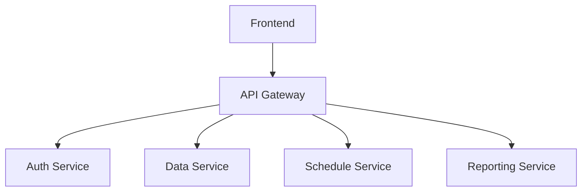

# Экспресс Расписание Колледжа 🚀

**Веб-приложение для управления расписанием учебного заведения**


## 📌 О проекте

**Экспресс Расписание для Колледжа** - это комплексная микросервисная система для автоматизации составления и управления учебным расписанием в средних специальных учебных заведениях.

Система предоставляет:

- Интеллектуальную генерацию расписаний

- Централизованное управление учебными данными

- Многофункциональную аналитику нагрузки

- Персонализированные интерфейсы для разных ролей

## 🌟 Ключевые возможности

### 📅 Управление расписанием

- Автоматическая генерация с учетом 50+ параметров

- Конфликт-менеджер занятий

- Гибкая система замен и переносов

- Визуальный редактор расписания

### 👨‍🏫 Администрирование

- Центр управления учебными планами

- Настройка нагрузок преподавателей

- Управление аудиторным фондом

- Контроль учебных групп

### 📊 Аналитика

- Мониторинг загрузки преподавателей

- Анализ использования аудиторий

- Статистика по группам

- Экспорт отчетов в 3-x форматах (excel, pdf, docx)

## 🛠 Технологический стек

Микросервисная архитектура



### Frontend


### Backend


### Инфраструктура


## 🚀 Быстрый старт

### Требования

- Docker 20.10+
- Docker Compose 1.29+
- Node.js 16+ (для разработки фронтенда)

### Инструкция

1. **Клонируйте репозиторий**:

   ```bash
   git clone https://github.com/iamlorddop/college-schedule.git
   cd college-schedule
   ```

2. **Настройте переменные окружения**:

   ```bash
   cp .env.example .env # Отредактируйте .env по необходимости
   ```

3. **Запустите систему**:

   ```bash
   docker-compose up -d --build
   ```

4. **Применяем миграции**:

   ```bash
   docker-compose exec backend python manage.py migrate
   ```

5. **Создаем суперпользователя**:
   ```bash
   docker-compose exec backend python manage.py migrate
   docker-compose exec backend python manage.py createsuperuser
   ```
6. **Запуск фронтенда (для разработки)**:

   ```bash
   cd frontend
   npm install
   npm run dev
   ```

7. **Система доступна по адресам**:

- Frontend: http://localhost:3000

- Backend API: http://localhost:8000

- Admin Panel: http://localhost:8000/admin

- RabbitMQ Management: http://localhost:15672

- PGAdmin (если включен): http://localhost:5050

## 📚 Документация

### API Endpoints

Полная документация API доступна после запуска:

```bash
http://localhost:8000/api/docs/
```

### Ролевая модель

1. **Администратор** - полный доступ

2. **Преподаватель** - просмотр своего расписания

3. **Студент** - просмотр расписания группы

### Примеры запросов

#### Авторизация:

```bash
curl -X POST http://localhost:8000/api/auth/login/ \
  -H "Content-Type: application/json" \
  -d '{"username":"admin", "password":"admin"}'
```

### Получение расписания:

```bash
curl -X GET http://localhost:8000/api/schedule/ \
  -H "Authorization: Bearer {token}"
```

## 🤝 Как внести вклад

1. Форкните репозиторий

2. Создайте ветку для вашей фичи (git checkout -b feature/AmazingFeature)

3. Сделайте коммит изменений (git commit -m 'Add some AmazingFeature')

4. Запушьте в ветку (git push origin feature/AmazingFeature)

5. Откройте Pull Request

## 📜 Лицензия

MIT License. Подробнее см. [LICENSE](./LICENSE.md).
